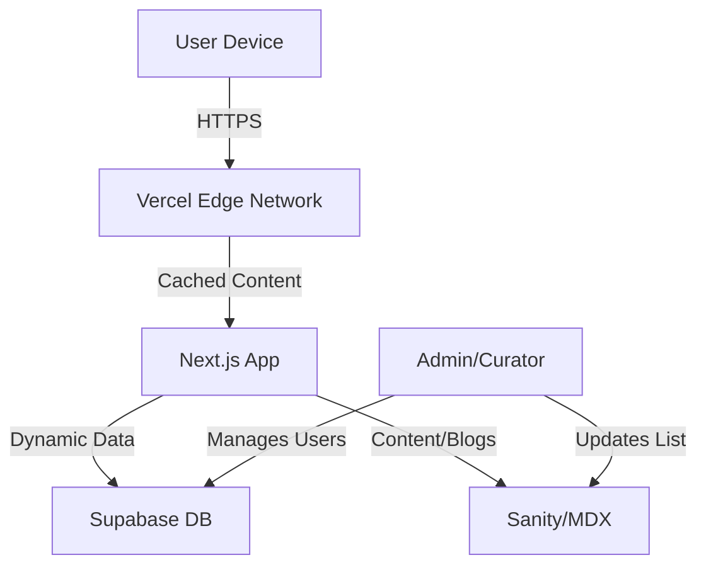

# Fortress Intelligence: Product Vision & Architecture Proposal

> [!IMPORTANT]
> **Core Principle:** "We don't predict prices. We publish frameworks."
> This platform is an **Educational Intelligence Layer**, bridging the gap between raw data (Screeners) and blind faith (Tipsters).

## 1. The Niche: "Curated Clarity"
We are positioning **Fortress Intelligence** as the "MasterClass of Indian Investing."
- **Not a Broker:** We don't execute trades.
- **Not a Tip Site:** We don't promise "multibaggers" or "instant returns."
- **Not a Screener:** We don't overwhelm with 5,000 stocks.

**The "Fortress Filter" USP:**
We do the heavy lifting of rejection. Meaningful curation is defined by what we *exclude*, not just what we include.
- **Transprency:** Every "Entrant" and "Exit" in the Fortress 30 has a detailed, educational "Why" attached.
- **Education First:** Users don't just copy; they learn *why* a company passed the "Business Quality" or "Financial Strength" layers.

## 2. Look & Feel: "Modern, Lean, Smart"
The UI must feel **premium, calm, and authoritative.** Avoid the "casino" aesthetic of trading apps.

### Design Language
- **Theme:** "Deep Slate" Dark Mode by default. High contrast for data, soft gradients for backgrounds.
    - *Backgrounds:* Deep charcoal/slate (not pitch black).
    - *Accents:* "Fortress Gold" (for high convection) and "Signal Blue" (for education).
- **Typography:** Clean sans-serif (Inter or Geist) for UI, serif (Merriweather or Playfair) for editorial content to emphasize the "Journal/Constitution" feel.
- **Motion:** "Scrollytelling" on the homepage. As users scroll, the "Funnel" visualizes: 5,000 stocks -> 500 screened -> 100 analyzed -> **Fortress 30**.

### Key UI Features
1.  **The "Fortress 30" Dashboard:**
    - A periodic table view or a "Constellation" view rather than a boring list.
    - **Hover Cards:** Hovering over a stock reveals the "One-Line Thesis" instantly.
    - **Risk Toggle:** A physical-feeling switch to toggle between "Conservative", "Balanced", and "Aggressive" modes, instantly re-weighting the list visually.

2.  **The "Why" Box:**
    - No stock appears without a "Why" box.
    - structured logic: *Megatrend Alignment* + *Moat* + *Financial Health*.

3.  **The Change Log (The Trust Engine):**
    - A dedicated "Constitution" timeline.
    - "Day 90 Rebalance" events are treated like product launches—high visibility, clear explanations.

## 3. Technical Architecture (The "Lean & Smart" Stack)
We will build a **Serverless, Headless, Reactive** web application.

### Tech Stack
- **Frontend:** **Next.js 14+ (App Router)**
    - *Why?* SEO optimization for the educational content, blazing fast edge caching, and React Server Components for complex data fetching.
- **Styling:** **Tailwind CSS** + **Framer Motion**
    - *Why?* Rapid premium UI development. Framer Motion for that "premium app" feel (smooth layout transitions when toggling risk modes).
- **Backend / Database:** **Supabase**
    - *Why?* Postgres power with firebase-like ease. Realtime subscriptions for live price updates (if needed later) and Auth built-in.
- **CMS (Content):** **Sanity.io** (or just Supabase with a custom Admin UI)
    - *Why?* You need to publish "Theses" and "Updates" easily. A structured content backend is crucial so you don't edit code to update the list.
- **Authentication:** **Clerk** or **Supabase Auth** (Social login + Magic links).

### Architecture Diagram

## 4. Phase 1 Roadmap (The "Fortress 30" MVP)
Focus purely on the **Fortress 30** list and the **Education** around it.

- **Sprint 1: Foundation**
    - Setup Next.js, Tailwind, Supabase.
    - Implement Auth (Family & Friends whitelist).
    - Build the "Static" Marketing/Manifesto page (The "Why").

- **Sprint 2: The Engine**
    - Design the Database Schema for `Stocks`, `Theses`, `RiskModes`.
    - Build the Admin Dashboard for *you* to input the Fortress 30 data easily.

- **Sprint 3: The Experience**
    - Build the User Dashboard (The List View).
    - Implement the "Risk Mode" toggle (Dynamic Weighting).
    - Add the "Stock Detail" modal/page (The "Why" content).

- **Sprint 4: Polish & Launch**
    - Add the "Change Log" timeline.
    - Mobile responsiveness check (Must be perfect on phone).
    - Deploy to Vercel.

## 5. Next Steps
1.  **Approve Vision:** Does this "Premium Educational Layer" resonate?
2.  **Approve Stack:** Is Next.js + Supabase acceptable? (Standard, scalable, low cost).
3.  **Execute:** I can begin setting up the project skeleton immediately.
